The Pyramid Match Kernel: Discriminative Classification with Sets of Image Features

Kristen Grauman and Trevor Darrell

Massachusetts Institute of Technology

Computer Science and Artificial Intelligence Laboratory

Cambridge\, MA\, USA

Introduction

Related Work

Pyramid Match Kernel

Satisfying Mercer’s Condition

Results

Conclusions

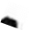

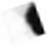

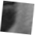

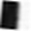

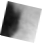

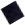

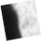

__It is often useful to represent a single example by the collection of local features or parts that comprise it\.__

__The image can be described by local features extracted from patches around salient interest points\, or a shape may be described by local descriptors defined at edge points\.__

_Set of Features in two images_

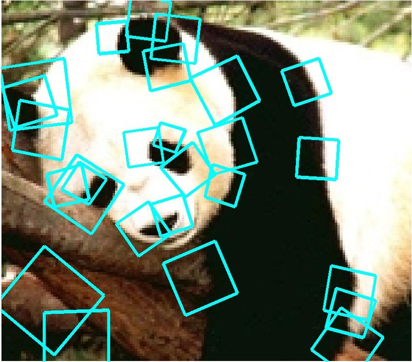

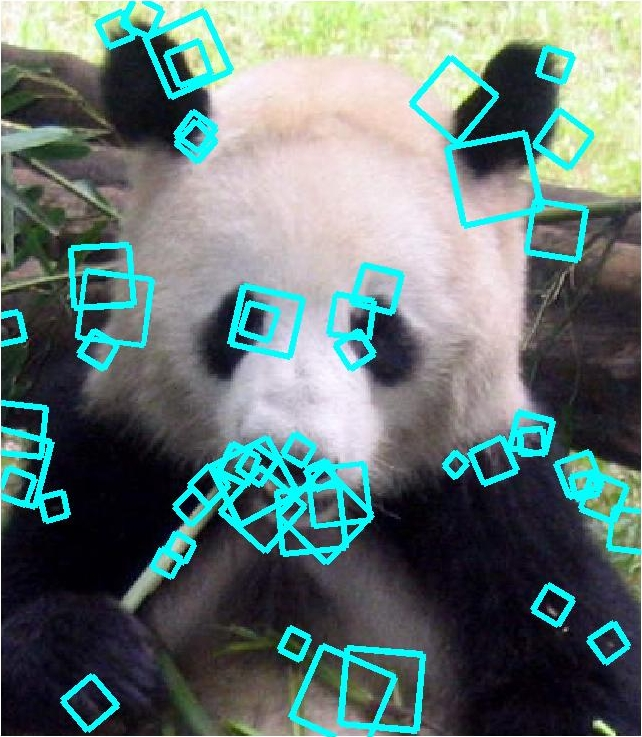

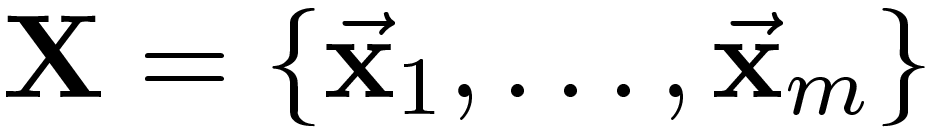

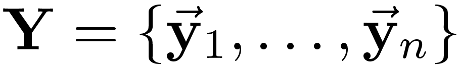

__To perform learning tasks like categorization or recognition with such representations is challenging in such cases\.__

__Support Vector Machine \(SVM\) is a widely used approach to discriminative classification that finds the optimal separating hyperplane between two classes\.__

__Kernel functions\, which measure similarity between inputs\, introduce non\-linearities to the decision functions; the kernel non\-linearly maps two examples from the input space to the inner product in some feature space\.__

__Conventional kernel\-based algorithms are designed to operate on fixed\-length vector inputs and hence commonly used general\-purpose kernels defined on n inputs \(e\.g\.\, Gaussian RBF\, polynomial\) are not applicable in the space of vector sets\.__

__The pyramid match kernel – a new kernel function over unordered feature sets that allows them to be used effectively and efficiently in kernel\-based learning methods\. Each feature set is mapped to a multiresolution histogram that preserves the individual features’ distinctness at the finest level\.__

_To perform learning tasks like categorization or recognition with such representations is challenging in such cases\._

_Pyramid Match Kernel_

__Pyramid matching: an efficient method that maps unordered feature sets to multi\-resolution histograms__  __\.__

__Computes a weighted histogram intersection to  find implicit correspondences based on finest  resolution histogram cell where a matched pair first appears__  __\.__

__Approximates similarity measured by optimal  correspondences between feature sets of  unequal cardinality__  __\.__

1GraumanandDarrell\, The PyramidMatchKernel:DiscriminativeClassificationwithSetsofImageFeatures\, IEEEICCV2005\,Vol2\, pp\.1458–1465

histogram pyramids

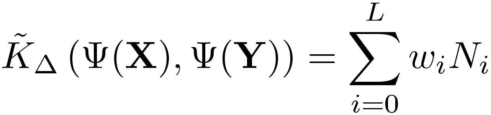

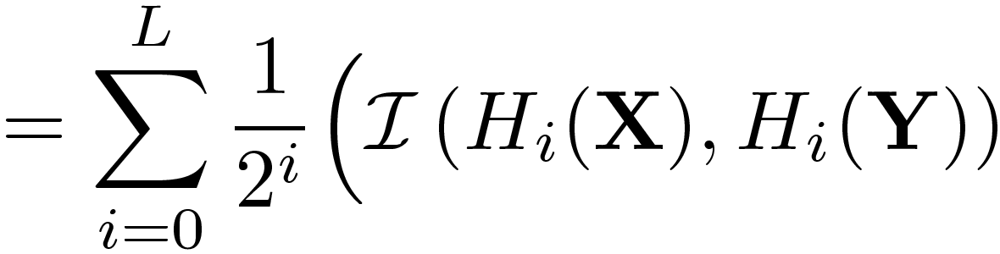

number of newly matched pairs at level   _i_ 

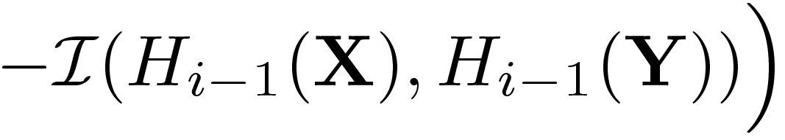

measure of difficulty of a match at level  i

_Pyramid Match Kernel_

__Weights inversely proportional to bin size__

__Normalize kernel values to avoid favoring large sets__

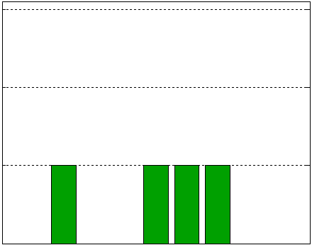

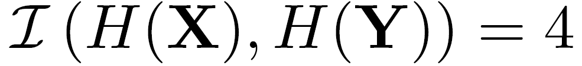

_Histogram Intersection_

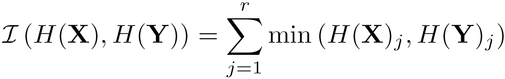

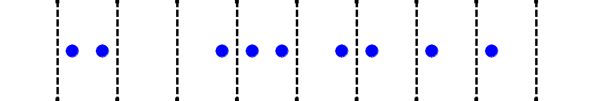

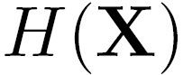

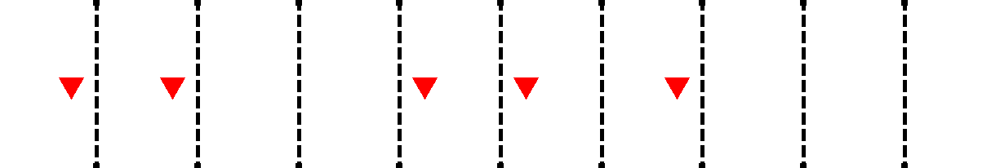

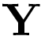

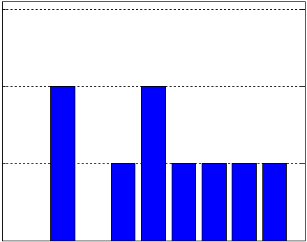

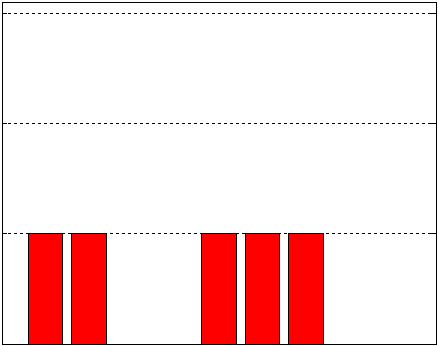

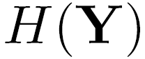

__matches at this level__

__matches at previous level__

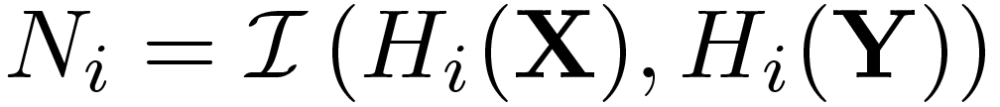

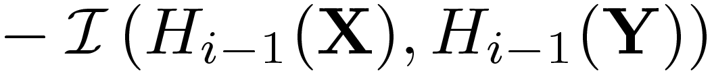

Difference in histogram intersections across levels counts _number of_  _new pairs_ matched

_Histogram Intersection_

_Pyramid Match Kernel: Method_

__1\-D point sets X\, Y on grid of size 1__

_Pyramid Match Kernel: Method_

__1\-D point sets X\, Y on grid of size 1 \- level 0 histograms__

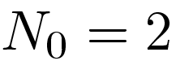

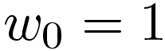

_Pyramid Match Kernel: Method_

__1\-D point sets X\, Y on grid of size 1 \- level 0 histograms \- intersection__

_Pyramid Match Kernel: Method_

__1\-D point sets X\, Y on grid of size 1 \- level 0 histograms \- intersection  2\.__

__Matches weighted by 1\.__

__Using                      the total similarity score: 2 × 1 = 2__

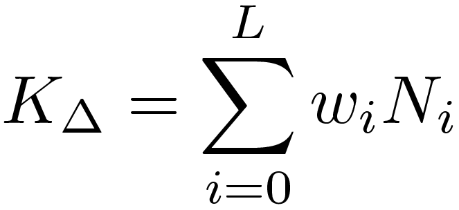

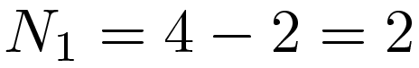

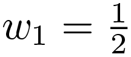

_Pyramid Match Kernel: Method_

__1\-D point sets X\, Y on grid of size 2 \- level 1 histograms – intersection\.__

__\(2 matches weighted by 1\) \+ \(2 weighted by ½ \)\.__

__Using                      calculate total similarity score: 2 × 1 \+ 2 x ½ =3__

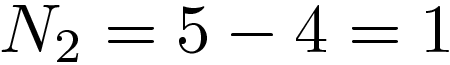

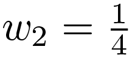

_Pyramid Match Kernel: Method_

__1\-D point sets X\, Y on grid of size 4 \- level 2 histograms \- intersection\.__

__\(2 matches weighted by 1\) \+ \(2 weighted by ½ \) \+ \(1 weighted by ¼ \)__

__Using                    total similarity score: 2 × 1 \+ 2 x ½ \+ 1 x ¼  = 3\.25__

_Pyramid Match Kernel: Method_

__Weighted sum of histogram intersections at different levels of two images approximates their optimal pairwise matching__

_Pyramid Match Kernel: Efficiency_

__For sets with m features of dimension d\, and pyramids with L levels\, computational complexity of__

_Pyramid match kernel:_

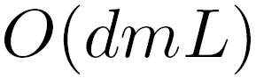

_Existing set kernel approaches:_

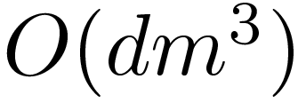

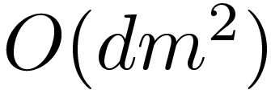

_Results: Approximate Partial Matchings_

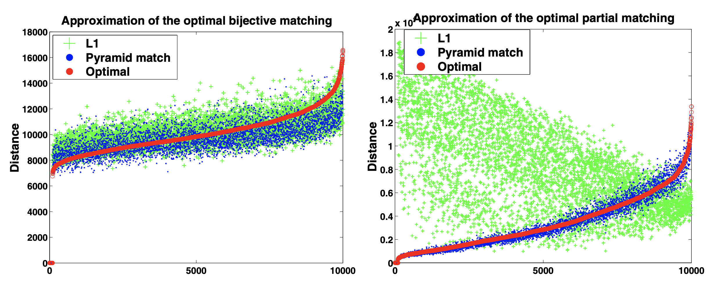

Trial number \(sorted by optimal distance\)

Trial number \(sorted by optimal distance\)

__2\-D points with values uniformly distributed between 1 and 1000\.__

__In one data set\, each point set had equal cardinalities \(100 points each\)\, while in the other cardinalities varied randomly from 5 to 100\.__

_Results : Approximate Partial Matchings_

__Equal cardinality case \(plot on left\)\, both the pyramid match and the L1 embedding produce good approximations; both are on average less than 9% away from the optimal measure\.__

__Pyramid match also approximated the partial matching for the unequal cardinality case and its matchings continue to follow the optimal matching’s trend since it does not penalize outliers\, whereas the L1 embedding fails because it requires all points to match to something\.__

__This method was less than 9% on an average away from the optimal matching’s measure for the unequal cardinality case\, while the L1 matching has an average error of 400%__

_Results : Object Recognition_

* __Train SVM by computing kernel values between all labeled training examples\.__
* __Classify novel examples by computing kernel values against support vectors__
* __ETH\-80 database:__
* __\- 8 object classes__
* __Features:__
  * __\- Harris detector__
  * __\- PCA\-SIFT descriptor\, d=10__

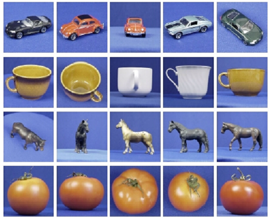

_Results : Object Recognition_

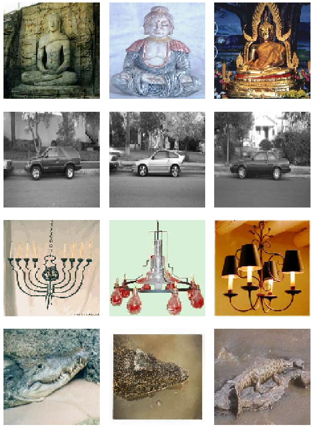

* Caltech objects database 101 object classes
* Features:
  * SIFT detector
  * PCA\-SIFT descriptor\, _d_ =10
* 30 training images / class
* 43% recognition rate
* \(1% chance performance\)
* 0\.002 seconds per match

